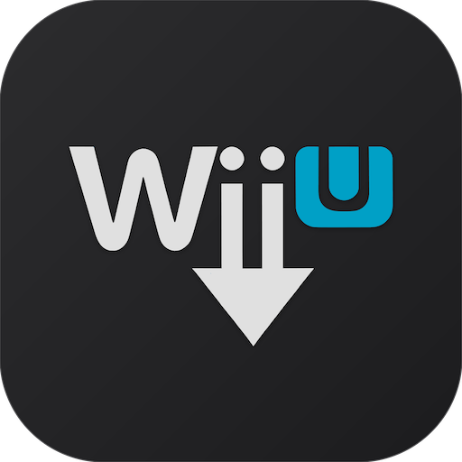
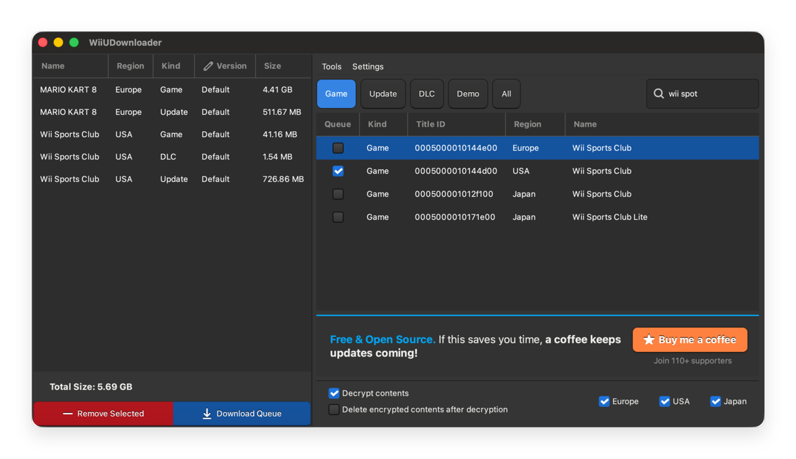
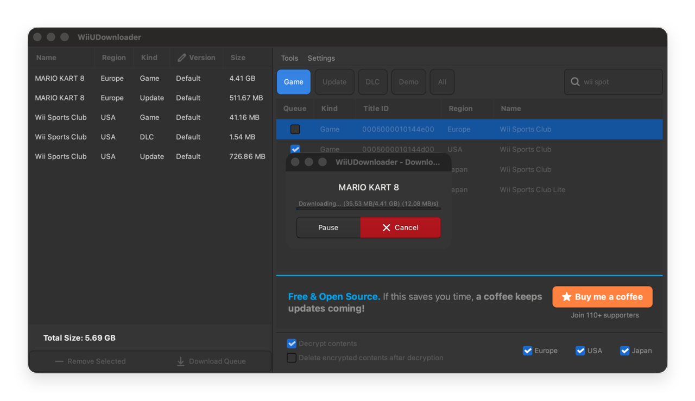

<p align="center">
  
</p>

<h1 align="center">WiiUDownloader</h1>

<p align="center">
  <strong>The open-source Wii U downloader that works on Windows, macOS, and Linux.</strong><br>
  Download Wii U games, updates, DLC, and demos directly from Nintendo's servers, no title keys needed.
</p>

<p align="center">
  <a href="https://github.com/Xpl0itU/WiiUDownloader/releases/latest"></a>
  <a href="https://github.com/Xpl0itU/WiiUDownloader/blob/main/LICENSE"></a>
  
  <a href="https://github.com/Xpl0itU/WiiUDownloader/stargazers"></a>
  <a href="https://ko-fi.com/L3L5JUPXR"></a>
</p>

---

## Screenshots

<p align="center">
  
  
</p>

---

## Looking for a Wii U USB Helper alternative?

Wii U USB Helper is abandoned. It only runs on Windows. Antivirus software frequently flags it. Setup requires hunting down title key sites that come and go, and even when you get it working, server connection failures are constant.

**WiiUDownloader is the replacement the community recommends.** It runs on Windows, macOS, and Linux. It downloads directly from Nintendo's CDN (NUS). No title keys. No launchers. No manual configuration.

| | Wii U USB Helper | WiiUDownloader |
|---|---|---|
| **Maintained** | No (abandoned) | Yes (active) |
| **Windows** | Yes | Yes |
| **macOS** | No | Yes |
| **Linux** | No | Yes |
| **Open source** | No | Yes (GPLv3) |
| **Title keys required** | Yes | No |
| **Antivirus flags** | Common | None |
| **Setup** | Hunt down title keys, configure launchers | Download, open, ready |

---

## Features

- Browse the full Wii U library: games, updates, DLC, demos, and Virtual Console titles
- Search by name or Title ID
- Queue multiple titles for batch download
- Filter by region (Japan, USA, Europe) and content type
- Automatic decryption, ready for your console or Cemu
- Optional: delete encrypted files after decryption to save disk space
- Resume interrupted downloads
- Re-decrypt previously downloaded files without re-downloading

---

## Installation

Pick your platform. Double-click. Done.

| Platform | Download |
|---|---|
| **Windows** | [WiiUDownloader-Windows.zip](https://github.com/Xpl0itU/WiiUDownloader/releases/latest/download/WiiUDownloader-Windows.zip) |
| **macOS** (Intel + Apple Silicon) | [WiiUDownloader-macOS-Universal.dmg](https://github.com/Xpl0itU/WiiUDownloader/releases/latest/download/WiiUDownloader-macOS-Universal.dmg) |
| **Linux** (Intel/AMD 64-bit) | [WiiUDownloader-Linux-x86_64.AppImage](https://github.com/Xpl0itU/WiiUDownloader/releases/latest/download/WiiUDownloader-Linux-x86_64.AppImage) |
| **Linux** (ARM 64-bit) | [WiiUDownloader-Linux-aarch64.AppImage](https://github.com/Xpl0itU/WiiUDownloader/releases/latest/download/WiiUDownloader-Linux-aarch64.AppImage) |

**Linux users:** make the AppImage executable before running:

```bash
chmod +x WiiUDownloader-Linux-x86_64.AppImage   # Intel/AMD
chmod +x WiiUDownloader-Linux-aarch64.AppImage  # ARM
```

---

## How to download Wii U games

1. Launch WiiUDownloader
2. Search for a title or browse the list
3. Select your regions (Japan, USA, Europe) and content type (Game, Update, DLC, Demo, or All)
4. Click the **queue** checkbox on the titles you want
5. (Optional) Enable **Decrypt contents** if you want playable files for your console or Cemu
6. (Optional) Check **Delete encrypted contents after decryption** to save space
7. Click **Download queue** and pick where to save

Already downloaded files that need decryption? Go to **Tools → Decrypt Contents** and select the folder.

For a detailed walkthrough, see the [WiiUDownloader Usage Guide](https://xpl0itu.github.io/WiiUDownloaderDocs/docs/).

---

## Why WiiUDownloader over other Wii U download tools

**No title keys.** Other tools make you hunt down title keys from third-party sites. Those sites go offline. The files get outdated. WiiUDownloader generates what it needs.

**Cross-platform.** The only actively maintained Wii U NUS downloader that works on Windows, macOS, and Linux. Use it on your desktop, laptop, or Steam Deck.

**Open source.** The full source code is here. Anyone can audit it. No obfuscation, no surprises.

**Actively maintained.** Bugs get fixed. New features ship regularly. The project is alive.

**Simple.** Download, open, get your games. No command-line flags. No tutorials required.

---

## Frequently asked questions

### Is WiiUDownloader safe?

Yes. The source code is public under the GPLv3 license, anyone can audit it. Wii U USB Helper is frequently flagged by antivirus software because it's closed-source and hooks into system processes. WiiUDownloader is transparent.

### Does this work on Mac?

Yes. Universal binary supports both Intel and Apple Silicon Macs. The only Wii U downloader with native macOS support.

### Does this work on Linux?

Yes. AppImage available for x86_64 and aarch64. Works on Steam Deck.

### Does this work on Steam Deck?

Yes. Download the Linux AppImage, make it executable, and run it in Desktop Mode. You can also add it as a non-Steam game to launch from Game Mode.

### Do I need title keys?

No. WiiUDownloader generates decryption keys from the title data itself.

### Can I use downloaded games with Cemu?

Yes. Decrypted files work directly with the Cemu Wii U emulator on PC.

### How do I fix "Wii U USB Helper not working"?

Stop fighting with it. Wii U USB Helper is abandoned, it hasn't been updated in years. Server endpoints change, title key sites disappear, and nobody is fixing the bugs. Switch to WiiUDownloader.

---

## Building from source

```bash
git clone https://github.com/Xpl0itU/WiiUDownloader.git
cd WiiUDownloader
curl -Lo db.go -H 'User-Agent: NUSspliBuilder/2.1' 'https://napi.v10lator.de/db?t=go' && if grep -q 'var titleEntry =' db.go; then if grep -q 'type TitleEntry struct' db.go; then sed -i '/type TitleEntry struct/,/}/d' db.go; fi && sed -i 's/var titleEntry =/func init() { TitleDatabase =/' db.go && echo '}' >> db.go; fi
cd cmd/WiiUDownloader && go build -o ../../WiiUDownloader .
```

Requires Go 1.25+ and GTK+3 development libraries.

---

## Important notes

WiiUDownloader downloads content from Nintendo's servers. Make sure you follow applicable laws in your country. Downloading copyrighted material without authorization may violate copyright law.

## License

GPLv3. See [LICENSE](LICENSE).

---

## Acknowledgments

Built with these excellent open-source libraries:

- [gotk3](https://github.com/gotk3/gotk3), Go bindings for GTK+3
- [golang.org/x/crypto](https://golang.org/x/crypto), Cryptographic primitives
- [golang.org/x/sync](https://golang.org/x/sync), Concurrency utilities
